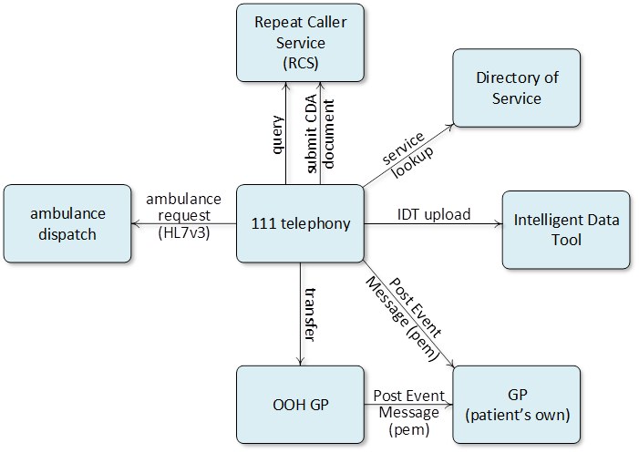

<!-- Urgent and Emergency Care (UEC) services are in place to support patients with serious or life-threatening emergencies as well as those with urgent care needs.

UEC services include 999 and 111 telephony and online services, ambulance, Emergency Departments (EDs), Urgent Treatment Centres (UTCs) as well as services supporting those with specific health emergencies (such as for mental health and dental).

This site provides technical standards and guidance for those who commission, provide and support UEC services, including suppliers, and should be read in conjunction with other UEC specifications including the NHS England Integrated Urgent Care Specification and the NHSE Commissioning Standards for Integrated Urgent Care.

These Interoperability & Technical Standards support the [NHS England Integrated Urgent Care Service Specification](https://www.england.nhs.uk/wp-content/uploads/2014/06/Integrated-Urgent-Care-Service-Specification.pdf)

If you have any queries about this content, please email the following mailbox: [uecintegration@nhs.net](mailto:uecintegration@nhs.net)

### References

1. [https://www.england.nhs.uk/urgent-emergency-care/about-uec/](https://www.england.nhs.uk/urgent-emergency-care/about-uec/)
2. [https://www.nhs.uk/NHSEngland/AboutNHSservices/Emergencyandurgentcareservices/Pages/urgent-care-overview.aspx](https://www.nhs.uk/NHSEngland/AboutNHSservices/Emergencyandurgentcareservices/Pages/urgent-care-overview.aspx)
3. [https://www.england.nhs.uk/urgent-emergency-care/nhs-111/resources/](https://www.england.nhs.uk/urgent-emergency-care/nhs-111/resources/)
4. [https://www.england.nhs.uk/wp-content/uploads/2014/06/Integrated-Urgent-Care-Service-Specification.pdf](https://www.england.nhs.uk/wp-content/uploads/2014/06/Integrated-Urgent-Care-Service-Specification.pdf)
5. [https://www.england.nhs.uk/wp-content/uploads/2015/10/integrtd-urgnt-care-comms-standrds-oct15.pdf](https://www.england.nhs.uk/wp-content/uploads/2015/10/integrtd-urgnt-care-comms-standrds-oct15.pdf)
 -->

The [NHS England Integrated Urgent Care Service Specification](https://www.england.nhs.uk/wp-content/uploads/2014/06/Integrated-Urgent-Care-Service-Specification.pdf) references a number of current Interoperability and Technical Standards that should be supported by supplier systems used by UEC providers.  This site details those standards and provides guidance on how to implement these and also gain accreditation where required.

These standards can be categorised into two groups:
-	Interactions to support the flow of patients between UEC services e.g. transfer of care messaging, DOS service lookups to find services where a patient may go for treatment, and post event messaging to a patient’s GP
-	Interoperability to support the user in a patient encounter within a care setting e.g. identifying the patient, accessing patient records and treating the patient

A number of these standards are already fully specified and can be implemented by any supplier now.  These are detailed in the [Current Capabilities section](#).

In addition to these, the IUC Service Specification outlines new interoperability standards.  These are described in the Emerging Capabilities section.  These are being developed now by programmes.

## Capabilities to support a patient journey
There are a number of APIs and interoperability messages used across Urgent and Emergency Care to support patient flows between services.

The current capabilities in this area are shown below:

## Capabilities to support a patient encounter
In addition to the capabilities to support a full UEC patient journey, UEC supplier systems may also integrate to the following services to support their encounter management with patients.

Current capabilities in this area include:

-	[Patient Identification](personal_demographics_service.html)
-	[View Summary Care Records](summary_care_record.html)
-	[Electronic Prescribing including the use of Electronic Prescription Tracker](electronic_prescribing.html)
